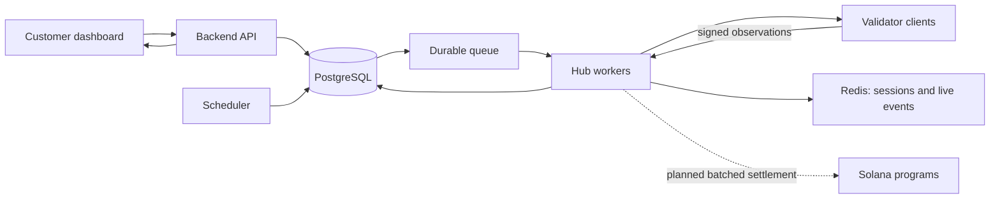

# Dipin Uptime

**Reliable website monitoring through geographically distributed observations.**

Dipin Uptime is an in-development monitoring platform designed to make availability easier to understand. Rather than relying on one probe location, the platform collects observations from independent validator clients across different networks and regions, then aggregates them into an explainable status for each monitored endpoint.

> **Project status:** active development / pre-production. The web dashboard, API, hub prototype, and validator prototype are present. Durable multi-hub scheduling, final aggregation policy, public validator onboarding, and on-chain settlement are planned work—not production-ready features.

## Why Dipin Uptime

Traditional uptime monitoring can miss regional outages, routing failures, and network-specific problems. Dipin Uptime is being built to provide:

- **Distributed visibility** — checks can originate from multiple regions and networks.
- **Explainable status** — final availability is based on a documented quorum policy and supporting observations.
- **Resilient architecture** — durable scheduling and stateless workers are the target, avoiding reliance on one coordinator instance.
- **A path to open participation** — validator reputation and settlement are planned as later layers, after the monitoring core is secure and reliable.

## Product principles

1. A signed validator result is an attributed observation, not automatic proof that a remote request was honestly performed.
2. Insufficient independent evidence should produce **unknown**, not a false claim that a service is up.
3. User-supplied targets must be safe to probe: SSRF protections are a core product requirement.
4. Customer-facing results are aggregates, not a dashboard inference from unprocessed raw checks.
5. Economic incentives must not compromise monitoring reliability or unfairly penalize validators.

## Architecture at a glance



PostgreSQL is the authoritative record for monitoring state. Redis is intended for short-lived coordination and live events, not as the source of truth for assignments or results.

For the detailed design, delivery phases, and security model, see [docs/design.md](docs/design.md).

## Repository layout

```text
apps/
  web/          Next.js customer dashboard
  api/          Express API for monitor management and authenticated queries
  hub/          Validator coordination and monitoring-dispatch prototype
  validator/    Validator-client prototype
packages/
  common/       Shared protocol types (moving toward runtime-validated schemas)
  db/           Prisma schema, migrations, and database client
  typescript-config/
  eslint-config/
docs/
  design.md     Architecture, security, and delivery roadmap
```

## Development setup

### Prerequisites

- Node.js 18 or newer
- pnpm 9
- PostgreSQL

### Install and run

```bash
pnpm install
pnpm db:generate
pnpm dev
```

The web application runs through its workspace development script. The API requires a valid database connection and authentication configuration. Configure local environment variables before starting services, including at minimum:

```text
DATABASE_URL=
NEXTAUTH_SECRET=
NEXTAUTH_URL=
NEXT_PUBLIC_BACKEND_URL=
```

Run commands for an individual workspace from that workspace directory when needed:

```bash
cd apps/web
pnpm dev
```

## Current roadmap

| Phase | Focus |
|---|---|
| Foundation | Shared runtime contracts, CI, consistent API status vocabulary |
| Secure validator MVP | Signed assignments/results and SSRF-safe HTTP(S) probing |
| Durable monitoring | Check-run state machine, outbox/queue, retries, multi-hub ownership |
| Aggregation | Quorum policy, incidents, history, `up` / `down` / `degraded` / `unknown` |
| Validator trust | Registry, diversity-aware selection, reputation, transparent fallback behavior |
| Economics | Batched receipts, stake lifecycle, objective-only slashing rules |
| Production rollout | Observability, runbooks, staging, controlled validator onboarding |

## Security and economics

The project intentionally does **not** place a blockchain transaction in the path of every availability check. The planned approach is to keep monitoring fast and durable off-chain, retain signed receipts, and settle eligible validator work in batches later.

Likewise, any future slashing mechanism must be limited to objectively verifiable cryptographic misbehavior—such as signing contradictory observations for the same assignment—not a subjective disagreement about an internet outage.

## Contributing

Before working on a feature, review [docs/design.md](docs/design.md). Changes that affect validator messages, monitoring outcomes, scheduling, or persistence should include:

- Runtime validation at the system boundary.
- Idempotency and failure/retry behavior.
- Tests or reproducible verification steps.
- Documentation updates when a product or protocol decision changes.

## License

No license has been declared for this repository yet. Do not assume permission for reuse or redistribution until a license is added.
