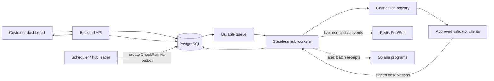

# Dipin Uptime — Architecture and Delivery Plan

## 1. Product goal

Dipin Uptime is a geographically distributed website-monitoring platform. Independent validators perform checks from different networks and regions, while the platform aggregates their observations into an auditable customer-facing status.

The product must provide:

1. Geographic visibility into global and regional availability problems.
2. Reliable, explainable monitoring results rather than a single opaque probe result.
3. A path to transparent validator incentives without making financial enforcement a prerequisite for a safe monitoring MVP.

## 2. Scope and delivery principle

The platform is delivered in layers. A secure, durable distributed-monitoring MVP comes before public validator onboarding, staking, or smart-contract settlement.

### MVP definition

The initial MVP includes:

- Customer authentication and monitor management.
- Safe HTTP(S) monitoring from approved validators.
- Signed, replay-safe validator observations.
- Durable scheduling, retries, and idempotent processing.
- A documented quorum policy that produces `up`, `down`, `degraded`, or `unknown`.
- Customer history, incidents, and operational audit trails.

The MVP explicitly excludes:

- Public permissionless validator onboarding.
- Per-check on-chain payments.
- Slashing based on a disputed website-availability result.

## 3. System components and ownership

| Component               | Responsibility                                                                         | Durable source of truth                          |
| ----------------------- | -------------------------------------------------------------------------------------- | ------------------------------------------------ |
| Frontend                | Customer dashboard, monitor configuration, status/history display                      | None; reads API data                             |
| Backend API             | Authentication, authorization, monitor management, customer-facing queries             | PostgreSQL                                       |
| Scheduler               | Creates due check runs and assigns ownership to a hub partition                        | PostgreSQL                                       |
| Hub workers             | Select validators, dispatch work, process observations, aggregate results              | PostgreSQL plus durable queue                    |
| Connection gateway      | Maintains validator sessions and routes assignments to active connections              | Shared connection registry; not authoritative    |
| Validator               | Safely performs assigned HTTP(S) checks and signs observations                         | Local ephemeral state and protected key material |
| PostgreSQL              | Monitor configuration, check state, observations, aggregates, incidents, audit records | Authoritative system record                      |
| Durable queue           | Dispatch, retry, delayed work, dead letters                                            | Queue backend                                    |
| Redis                   | Shared connection routing, rate limits, short-lived cache, live events                 | Never the authoritative job/result record        |
| Solana programs (later) | Validator stake lifecycle and batched settlement commitments                           | On-chain program state                           |

## 4. Target monitoring flow



The `CheckRun` lifecycle is durable. A validator WebSocket connection, Redis message, or in-memory callback must never be the only record that a check was assigned or completed.

## 5. Core domain model

Raw validator observations and customer-facing status must be separate records.

| Entity              | Purpose                                                                                           |
| ------------------- | ------------------------------------------------------------------------------------------------- |
| `Monitor`           | Customer-owned target, probe policy, interval, and enabled state.                                 |
| `CheckRun`          | One scheduled monitoring interval for one monitor; has a deadline and immutable monitor revision. |
| `Assignment`        | A specific validator’s lease to perform a `CheckRun`.                                             |
| `Observation`       | A signed result from one assignment, including safe evidence metadata.                            |
| `Aggregation`       | Deterministic final interpretation of observations for a check run.                               |
| `Incident`          | Idempotent customer-impacting state transition opened/resolved from aggregations.                 |
| `Validator`         | Validator identity, public key, observed network grouping, capacity, status, and reputation.      |
| `SettlementReceipt` | Later: signed eligible work item used for batched payment calculation.                            |

Required data characteristics:

- `CheckRun`, `Assignment`, and `Observation` have immutable IDs and state-transition timestamps.
- Dispatch and result processing use idempotency keys.
- Raw observations are retained for a defined audit period; customer-facing history is downsampled for long retention.
- Indexes support monitor/time, validator/time, run state/deadline, and incident-state queries.

## 6. Monitoring state machine and reliability

### Check run state

```text
scheduled -> queued -> dispatching -> collecting -> aggregated -> finalized
                         |                 |
                         v                 v
                     cancelled          expired / unknown
```

- The scheduler creates runs transactionally in PostgreSQL and publishes work through an outbox.
- Workers claim a leased assignment and acknowledge progress durably.
- A timeout does not disappear silently: it is retried within policy or sent to a dead-letter workflow.
- Every transition is idempotent so restarts and duplicate delivery do not create duplicate checks or payments.
- Multiple hubs use leader election or explicit monitor partitions. Two hubs must not schedule the same monitor interval.
- Redis Pub/Sub may notify the UI about updates, but missed messages must be recoverable by querying PostgreSQL.

## 7. Validator protocol and trust boundaries

Validators are untrusted remote clients. A validator signature establishes attribution to a key; it does not prove that the validator genuinely performed a remote network request.

### Assignment requirements

Every assignment contains a canonical, versioned, hub-signed payload:

- `protocolVersion`
- `assignmentId` and `checkRunId`
- immutable monitor revision and probe configuration
- expiration/deadline
- unique nonce
- selected validator identity
- hub signature and domain-separation string

### Observation requirements

Every validator response signs the canonical payload containing:

- `assignmentId`, `checkRunId`, validator identity, and timestamp
- outcome and normalized error class
- HTTP status, timing breakdown, and safe redirect metadata
- resolved address classification, not sensitive response contents
- evidence hash and protocol version

The hub verifies the hub/validator signatures, identity binding, nonce, deadline, assignment ownership, and that the response has not already been accepted. Expired, malformed, unsolicited, tampered, and replayed responses are rejected and audited.

### Key and connection rules

- Validator private keys are local secrets; they must not be logged, transmitted, or stored in the database.
- Validator sessions use authenticated WebSockets, heartbeats, reconnect backoff, and graceful deregistration.
- Protocol schemas live in a shared runtime-validated package, not only TypeScript type declarations.
- Protocol upgrades use explicit version negotiation and a deprecation policy.

## 8. Safe target probing (SSRF policy)

Monitors are user-controlled URLs. Validator probing must not permit access to internal services or cloud metadata endpoints.

- Allow only HTTP and HTTPS URLs.
- Normalize and validate URLs at monitor creation and again immediately before connection.
- Resolve DNS before each connection; block loopback, private, link-local, multicast, unspecified, and metadata address ranges for IPv4 and IPv6.
- Revalidate every redirect target and protect against DNS rebinding.
- Restrict allowed ports; define maximum redirects, connection/read timeout, response body size, and TLS handling.
- Do not persist response bodies or credentials. Persist only safe metadata needed for audit and aggregation.
- Maintain adversarial test cases for encoded hosts, unusual IP literals, redirect chains, private addresses, and DNS rebinding.

## 9. Aggregation and incident policy

The customer sees an aggregate result, not a dashboard interpretation of raw ticks.

Each monitor policy defines:

- target validator count and maximum per-validator capacity
- minimum response count and deadline
- minimum diversity across region and network/operator group
- result thresholds for `up`, `down`, `degraded`, and `unknown`
- retry and timeout behavior
- incident opening/resolution thresholds and debounce period

Suggested initial outcomes:

| Outcome    | Meaning                                                                              |
| ---------- | ------------------------------------------------------------------------------------ |
| `up`       | Sufficient independent evidence that the target satisfies the probe policy.          |
| `down`     | Sufficient independent evidence of a target-level failure.                           |
| `degraded` | A meaningful regional or network-specific failure exists without global-down quorum. |
| `unknown`  | Insufficient timely, independent evidence; it is not assumed to be up.               |

Aggregation must be deterministic: the same accepted observation set and policy revision always produce the same result. The stored aggregate records the policy revision, contributing observations, diversity information, confidence, and reason.

## 10. Validator selection, diversity, and reputation

Selection must resist concentration. Do not trust a validator’s self-reported location or treat stake as the sole measure of independence.

- Group validators by operator identity, wallet linkage, observed ASN/network, hosting provider, and other available evidence.
- Cap selection from any one operator or network group.
- Consider availability, capacity, response timeliness, historical reliability, and stake eligibility.
- Bound stake/reputation influence so a wealthy or old operator cannot dominate every quorum.
- Use a decaying reputation model and make selection decisions explainable in audit data.
- AWS fallback validators are a separate class. Their observations are labeled and cannot satisfy a decentralized quorum alone.

Public, permissionless validator onboarding begins only after the approved-validator MVP meets reliability and security gates.

## 11. Economics and Solana roadmap

On-chain economics are a later layer, not part of the monitoring hot path.

### Initial on-chain scope

1. Validator stake deposit, withdrawal delay, and eligibility state.
2. Signed off-chain receipts for eligible completed work.
3. Periodic batched settlement using reproducible Merkle-root commitments.
4. Dispute and authority rules with a documented governance model.

### Slashing policy

Initial slashing is limited to objectively verifiable cryptographic evidence, such as a validator signing conflicting observations for the exact same assignment. A disputed remote availability observation is not, on its own, sufficient evidence for slashing.

Before mainnet value is introduced, require:

- a threat model and explicit program authorities
- unit, integration, and local-validator tests
- independent smart-contract security review
- rollback and emergency-pause governance process

## 12. API, shared contracts, and current consistency rules

- Keep the backend API responsible for authorization and customer-visible monitor/status queries.
- Validate all request, WebSocket, and queue payloads at runtime using shared schemas.
- Use one canonical status enum end-to-end. Database, hub, API, and frontend must not mix `Good`/`Bad` with `up`/`down`.
- Use one shared Prisma client export rather than independent clients per application process where a shared lifecycle is appropriate.
- All monitor ownership checks are enforced server-side for create, read, update, disable, and history operations.
- API responses expose aggregate status, confidence, last-checked time, and safe supporting observation metadata; they do not expose validator secrets or unsafe evidence.

## 13. Operational requirements

Before public rollout, provide:

- structured logs with correlation IDs from monitor through check run, assignment, observation, aggregate, and incident
- metrics for schedule lag, queue depth, worker failures, validator response rate, check duration, quorum failure, aggregate outcomes, and SSRF rejections
- traces across API, scheduler, queue, hub, and database operations
- audit logs for protocol rejection, selection, aggregation, incident, and settlement actions
- rate limits, key rotation, secret management, backup/restore procedures, migration policy, and alerting
- staging environment, controlled validator allowlist, hub/database failure drills, and rollback runbooks

## 14. Execution phases and release gates

| Phase                        | Outcome                                                                  | Release gate                                                                                 |
| ---------------------------- | ------------------------------------------------------------------------ | -------------------------------------------------------------------------------------------- |
| 0. Foundation                | Shared schemas, CI, status/API consistency, documented MVP decisions     | Typecheck/tests/Prisma validation run in CI; one canonical status contract.                  |
| 1. Secure validator MVP      | Functional validator, signed protocol, SSRF-safe probe                   | Controlled end-to-end check works; replay and SSRF tests pass.                               |
| 2. Durable scheduling        | Check-run state machine, outbox, queue, idempotency, multi-hub ownership | Restart/second-hub testing shows no lost or duplicate checks.                                |
| 3. Aggregation and incidents | Quorum policy, historical aggregates, incident state                     | Fixed observation fixtures yield deterministic outcomes.                                     |
| 4. Validator trust           | Registry, diversity-aware selection, reputation                          | One operator/network cannot satisfy configured quorum alone.                                 |
| 5. Economics                 | Batched receipts, stake lifecycle, narrow slashing scope                 | Settlement root is reproducible; independent security review completed before value at risk. |
| 6. Production rollout        | Observability, runbooks, staging, controlled onboarding                  | Failure drills and agreed reliability/security SLOs pass.                                    |

## 15. Decisions to keep explicit

The following must be marked as a decision—with owner, date, and policy version—before their associated phase is released:

- monitor intervals, probe type, timeout, redirect, TLS, and port policy
- aggregation quorum, diversity rule, outcome thresholds, and incident debounce
- raw-observation retention and customer-history retention
- validator registration, identity evidence, and fallback-validator policy
- reputation formula and maximum stake/reputation influence
- settlement cadence, fee policy, program authority, disputes, and withdrawal delay
- public validator admission and mainnet value-at-risk release gate

### Initial MVP decision record

The following defaults are approved for the Foundation phase. Any change requires an update to this table, a policy version increment, and an owner review.

| Decision               | Initial policy                                                                                                                            | Owner              | Recorded   | Version         |
| ---------------------- | ----------------------------------------------------------------------------------------------------------------------------------------- | ------------------ | ---------- | --------------- |
| Monitor interval       | 60 seconds by default; configurable only between 60 seconds and 1 hour.                                                                   | Project maintainer | 2026-08-07 | MVP policy v0.1 |
| Probe policy           | HTTP(S) only; ports 80/443; 10-second connection/read deadline; maximum 5 redirects; TLS failures are reported as probe failures.         | Project maintainer | 2026-08-07 | MVP policy v0.1 |
| Initial quorum         | Three assignments where capacity allows; two timely independent observations are required for `up` or `down`; otherwise return `unknown`. | Project maintainer | 2026-08-07 | MVP policy v0.1 |
| Diversity rule         | No operator/network group may contribute more than one observation to the minimum quorum.                                                 | Project maintainer | 2026-08-07 | MVP policy v0.1 |
| Retry and dead letters | One retry before a check-run deadline; unresolved failures are retained for review in a dead-letter workflow.                             | Project maintainer | 2026-08-07 | MVP policy v0.1 |
| Incident debounce      | Open after two consecutive `down` aggregations; resolve after two consecutive `up` aggregations.                                          | Project maintainer | 2026-08-07 | MVP policy v0.1 |
| Retention              | Retain raw observations for 30 days and customer-facing aggregate history for 13 months.                                                  | Project maintainer | 2026-08-07 | MVP policy v0.1 |
| Validator admission    | Use an approved validator allowlist only. AWS fallback results are labeled and cannot satisfy decentralized quorum alone.                 | Project maintainer | 2026-08-07 | MVP policy v0.1 |
| Billing and settlement | Customer billing and validator compensation stay off-chain during the MVP; no per-check on-chain settlement.                              | Project maintainer | 2026-08-07 | MVP policy v0.1 |

## 16. Ready-to-create issue: Foundation

### Title

```text
Phase 0: Establish shared contracts, engineering baseline, and architecture decisions
```

### Suggested labels

```text
architecture, foundation, priority:high
```

### Issue body

```markdown
## Goal

Establish the shared contracts, engineering safeguards, and documented MVP decisions needed before building distributed validator or settlement features.

## Why this matters

The current project is an early prototype. API, database, hub, and dashboard code must share one validated vocabulary before durable scheduling, aggregation, or validator networking can be safely expanded. In particular, status values are currently inconsistent (`Good` / `Bad` in the database and hub versus `up` / `down` in the dashboard).

## Scope

### Shared contracts

- Create versioned shared runtime schemas in `packages/common` for:
  - monitor create/update requests and monitor configuration
  - monitor status and customer-facing API responses
  - validator registration, assignment, and signed observation messages
  - normalized failure/error classes
- Use the schemas at every API, WebSocket, and queue boundary; TypeScript types alone are not sufficient.
- Define one canonical status enum used by the database, hub, API, and frontend. Include `up`, `down`, `degraded`, and `unknown`, or document the approved equivalent mapping.
- Add schema fixtures/tests for valid messages and rejected malformed payloads.

### Engineering baseline

- Rename the root package and scripts so they describe Dipin Uptime rather than the inherited `chess` project name.
- Standardize service scripts for web, API, hub, validator, build, lint, typecheck, test, and database generation.
- Remove duplicate Prisma-client construction where a shared package export is appropriate.
- Add CI that runs formatting checks, linting, type checks, tests, Prisma schema validation/generation, and dependency audit.
- Document the required local environment variables without committing secrets.

### MVP architecture decisions

Record the following as explicit, versioned decisions in `docs/design.md`:

- default monitor interval and permitted configuration range
- HTTP(S) probe policy, allowed ports, timeout, redirect, and TLS behavior
- initial quorum size, deadline, diversity requirement, and `unknown` behavior
- retry, dead-letter, and incident debounce policy
- raw-observation and customer-history retention periods
- approved-validator MVP boundary and AWS fallback labeling policy
- customer billing boundary and the decision to defer per-check on-chain settlement

## Acceptance criteria

- [ ] `packages/common` exposes versioned runtime schemas and inferred TypeScript types for API and validator protocol boundaries.
- [ ] Malformed, incomplete, and unsupported-version payloads are rejected at the API/WebSocket boundary.
- [ ] A single canonical status contract is used end-to-end; the dashboard no longer interprets `Good` / `Bad` as `up` / `down` incorrectly.
- [ ] Root package metadata and service scripts use the Dipin Uptime product name.
- [ ] CI runs successfully for formatting, linting, type checking, tests, Prisma validation/generation, and dependency audit.
- [ ] Required environment variables and local setup are documented without secrets.
- [ ] The MVP decisions listed above are recorded in `docs/design.md` with an owner, date, and policy/protocol version.

## Non-goals

- Implementing public validator onboarding, reputation, stake, or Solana programs.
- Building durable multi-hub scheduling or aggregation logic.
- Introducing a queue or Redis deployment.
- Implementing SSRF-safe probe execution; this is the next phase once the shared contracts exist.

## Verification

1. Run the CI commands locally and in a pull request.
2. Submit valid and invalid API/WebSocket fixture payloads and confirm validation behavior.
3. Confirm a successful and failed monitoring result renders with the correct status in the dashboard.
4. Review the recorded MVP decisions before beginning the secure-validator phase.
```

## 17. Guiding rules

1. PostgreSQL is the authoritative record; queues are durable transport; Redis is not the source of truth.
2. Treat all validator and network input as untrusted until runtime-validated and cryptographically verified.
3. A signed result is an attributed observation, not proof of a genuine HTTP fetch.
4. Prefer `unknown` over falsely claiming availability when independent evidence is insufficient.
5. Preserve customer safety and operational reliability before decentralization incentives.
6. Do not put per-check settlement or subjective slashing in the critical monitoring path.
